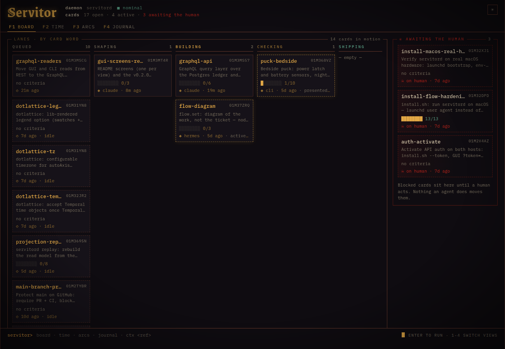
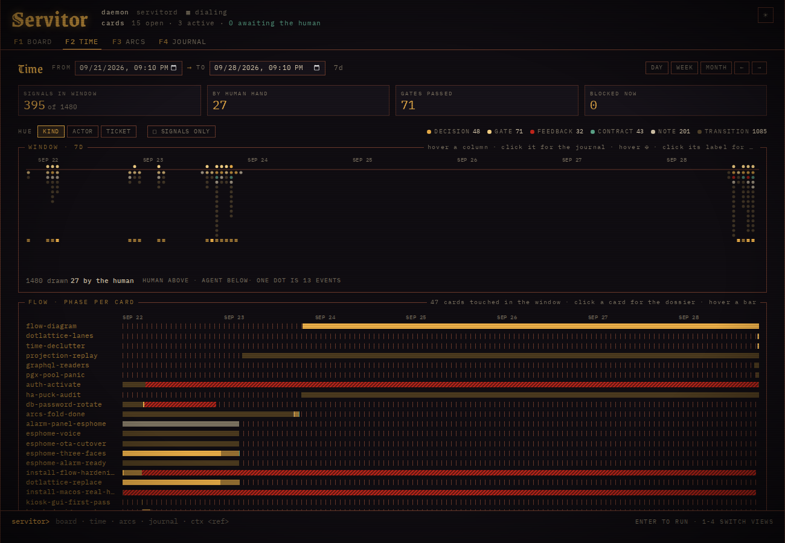
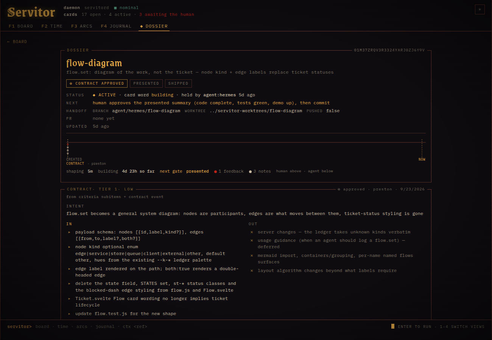
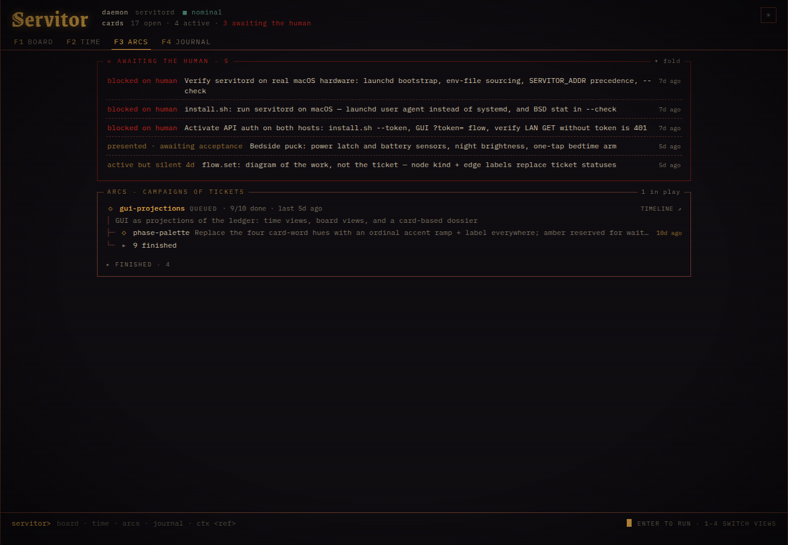
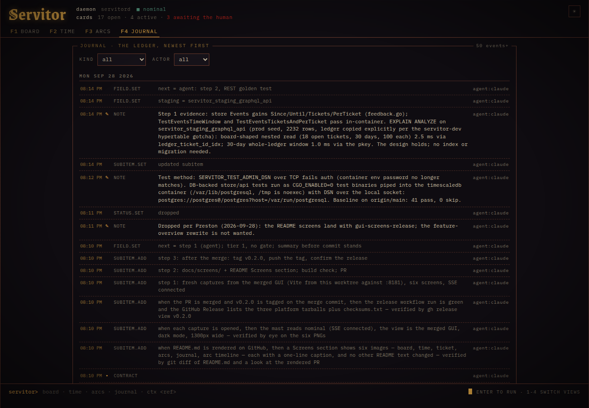
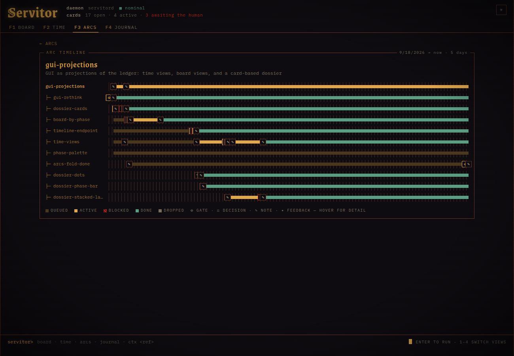

# servitor

Work tracking as an append-only event ledger. Nothing is edited, nothing is
deleted; corrections are new events. The store is the system of record.

## Components

- `servitord` — HTTP API daemon (`:27182`). Stateless; the store is the only backend.
- `servitor` — CLI. Thin client: holds no state, applies no rules.
- `servitor-mcp` — same Service exposed as MCP tools over stdio.
- `web/` — Svelte GUI (read-only).

The Go layer owns the projection; the schema intentionally has no apply
trigger. One transaction per `append_event`.

## Screens

The GUI reads the ledger and draws it as a cogitator terminal. Keys 1-4
switch views; the prompt line at the foot takes `board`, `time`, `arcs`,
`journal` and `ctx <ref>`.

**Board** — lanes by card word; cards that wait on a human sit in the red rail.



**Time** — the ledger, one dot per event, hue by kind, actor or ticket; a column opens the journal, a ✠ mark reveals its gates and opens the dossier; Flow is a phase bar per card the window touched.



**Ticket** — the dossier: gates, contract, criteria, plan, handoff fields, ledger.



**Arcs** — campaigns of tickets as a tree; what waits on you sits above them.



**Journal** — the whole ledger, newest first, filtered by kind and actor.



**Arc timeline** — one lane per member from the arc's first event to now.



## Model

- Every ticket and sub-item has a ULID. Sub-items are addressed by prefix.
- A **slug** is a mutable alias, unique case-insensitively across all history.
- Five statuses: `queued`, `active`, `blocked` (requires `blocked_on`),
  `done`, `dropped`. "Archived" is a query, not a status.
- **Gates** replace phase ladders: `contract_approved` (human only),
  `presented`, `shipped`. A card word (shaping/building/checking/shipping)
  derives from the latest gate — never set by hand.
- Events carry one actor of record: `human:`, `agent:`, or `system`.
  Judgment events carry human actors; the store enforces it.
- Three rules of the live write path, each a stable error code: a ticket
  goes `active` (or records a commit) only with a `tier` 0..3
  (`tier_required`); a tier 2+ ticket records a commit only after
  `contract_approved` (`contract_required`); `done` needs every criterion
  `pass`, or a human's `--waive "<why>"` on the status row
  (`criteria_incomplete`, `human_waiver_required`). Replay does not
  re-adjudicate: history written before a rule still rebuilds.
- Arcs group tickets: an arc is any ticket another points at via
  `parent=<arc-ulid>`. Rollup status, member count and last activity are
  derived, never set by hand.
  `source`/`source_ref`/`depends`/`area` are free fields;
  history events carry a derived `class` (signal|transition).

## Usage

Agents interact only via the CLI or MCP

```
servitor hook [ref]       SessionStart hook: preflight header + ctx; always exits 0
servitor hook --hermes    the same output as a Hermes pre_llm_call context
                          injection (first turn only; reads the hook payload
                          on stdin); install.sh registers it in the Hermes
                          profile config.yaml
servitor hook --cursor    the same output as a Cursor sessionStart hook
                          response ({"additional_context": ...}; reads the
                          payload on stdin for the conversation id);
                          install.sh registers it in ~/.cursor/hooks.json
servitor ctx [ref]        ticket aggregate, JSON only; always exits 0
servitor board            queued/active/blocked, rank-ordered
servitor arcs             arcs with derived rollups
servitor new --slug S --tier 0..3
                          -> ticket ULID; the tier rides in the create event,
                          so no ticket exists unclassified
servitor set <ref> ...    status / PR / free field=value pairs
servitor log <ref> note   append an event
servitor gate <ref> <g>   pass a gate
servitor history <ref>    full event timeline
```

Orient on `board`, classify at intake, log as you go, pass gates at
handoffs, record blockers as `blocked --on <party>`. Never fake done.

The `concise-tone` skill, linked by default, is the voice for every reply and
outbound text: lead with the point, cut ceremony. Agents also carrying the
optional `servitor-tone` skill (`--tone` at install) report servitor state in
a fixed grammar — state, result, obstruction, one line each, `no change.` when
there is none:

```
skill-link-verify · done · shipped
done: install.sh links no skill the tree does not carry
evidence: 43 assertions; --check exits 0
next: nothing. Branch and worktree released.
```

## Install

```
./install.sh [--check] [--from-source] [--version TAG]
             [--tone|--no-tone] [--dsn URL] [--token TOKEN]
```

Downloads the release matching this host, verifies its checksum, and
installs into `~/.local/bin`; `--from-source` builds from the checkout
instead and `--version` pins a tag. Then restarts the `servitord` unit and
links the skills into detected agent skill directories — skipping, with a
warning, any the tree does not carry. `--check` reports drift.

Secrets live in `~/.config/servitor/servitord.env` (mode 0600), created on
first run from `--dsn` or by migrating the DSN out of an older unit; reruns
without `--dsn` keep it. `servitord apply-schema` runs against that DSN
before the restart, so a pending migration never leaves the daemon 500ing
on new columns; if it fails, install aborts without restarting.
`servitor-mcp` sources the same file.

## Replay

`servitord replay` rebuilds the read model (tickets, slug history,
sub-items, gates, watermark) from the ledger alone, for when the
projection code changed or an old daemon dropped a payload key. It runs
in one transaction that holds every writer until it commits; the ledger
is never touched. Sub-items keep their ULIDs: the run snapshots
`(ticket, kind, created_at) → ULID` before truncating, so prefixes
recorded in later events still resolve. A row that fails to re-apply
aborts the run naming the event; `--lossy` skips such rows and lists
them. `--dry-run` does the whole run, rolls it back, and prints the same
report. On an empty read model (a restore from a ledger dump alone)
sub-item identities are minted fresh and events that addressed the old
ones by prefix are the rows `--lossy` skips.

```
SERVITOR_DSN=... servitord replay --dry-run
SERVITOR_DSN=... servitord replay
```

## Tests

`go test ./...` runs the pure-logic tests anywhere. The database-backed
tests (store, api, graphql, mcp, cli) create and drop throwaway databases
through a superuser DSN in `SERVITOR_TEST_ADMIN_DSN`, and skip without it.
The server needs the timescaledb extension.

```
SERVITOR_TEST_ADMIN_DSN='postgres://postgres:PW@localhost:5432/postgres?sslmode=disable' go test -p 1 ./...
```

CI runs the same against a `timescale/timescaledb` service on every PR
and fails the job on any skipped test.

## Environment

| Variable | Purpose | Default |
|---|---|---|
| `SERVITOR_API` | CLI target | `http://localhost:27182` |
| `SERVITOR_DSN` | Postgres/Timescale DSN (daemon, MCP) | local `servitor` DB |
| `SERVITOR_ADDR` | daemon listen address | `:27182` |
| `SERVITOR_TOKEN` | bearer-token auth for the API | off |
| `SERVITOR_ACTOR` | actor of record; overrides the derived one | derived: `agent:claude` under Claude Code, `agent:hermes` under Hermes, `agent:cursor` under Cursor, else `agent:cli` |
| `SERVITOR_HOST` | host stamped on writes (containers) | short lowercased hostname |
| `SERVITOR_TICKET` | hook focus ticket | — |

Every write names its author: the actor, the host it came from, and the
harness session (`CLAUDE_CODE_SESSION_ID` or `HERMES_SESSION_ID`, which the
harness exports to every command). Cursor exports only the `CURSOR_AGENT`
marker to its shells, so writes from Cursor carry no session; the hook
alone sees the conversation id. The CLI sends them as `X-Servitor-Host`
and `X-Servitor-Session`; a write without them is accepted and reads back
host `null`, session `""`. `servitor ctx` lists a ticket's `authors`
(newest ten plus `authors_total`), and the hook prints one `handoff
author:` line comparing you with the last one.

## Database bootstrap (one-time)

The `servitor` role must own the schema — servitord, servitor-mcp and
`apply-schema` run under it, and migrations need ALTER rights. On a fresh
DB, as a superuser (once, idempotent):

```
psql -U postgres -d servitor -f deploy/grants.sql
```

`SERVITOR_DSN` then points at the `servitor` role; the daemon never needs
admin credentials.

---

++OBSERVATION NOTED. FUNCTION CONTINUES.++
